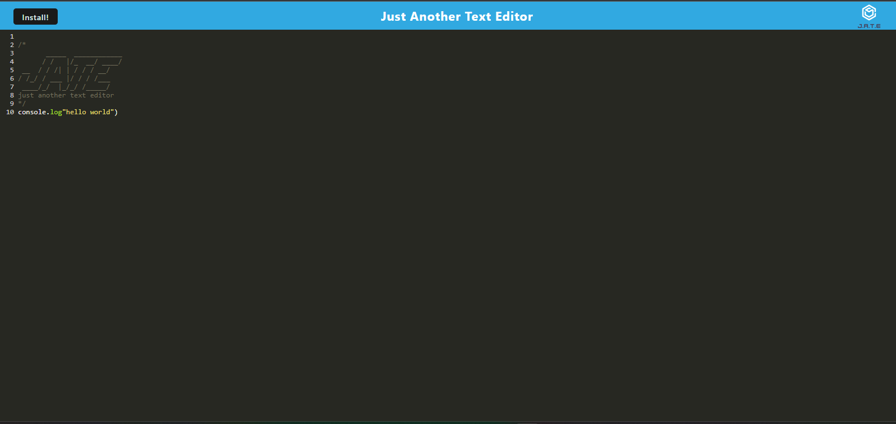
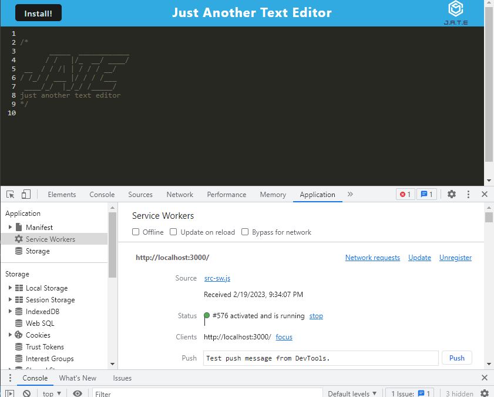

# PWA Text Editor
**PWA Editor** is an application built using HTML, CSS, JS, Sequelize, Json, insomnia, prettier, express, webpacks, idb and node.js.


## Images of the deployed website:
***

## Main Page


<br>

## Manifest page



## User Story

```md
AS A developer
I WANT to create notes or code snippets with or without an internet connection
SO THAT I can reliably retrieve them for later use
```

## Acceptance Criteria

```md
GIVEN a text editor web application
WHEN I open my application in my editor
THEN I should see a client server folder structure
WHEN I run `npm run start` from the root directory
THEN I find that my application should start up the backend and serve the client
WHEN I run the text editor application from my terminal
THEN I find that my JavaScript files have been bundled using webpack
WHEN I run my webpack plugins
THEN I find that I have a generated HTML file, service worker, and a manifest file
WHEN I use next-gen JavaScript in my application
THEN I find that the text editor still functions in the browser without errors
WHEN I open the text editor
THEN I find that IndexedDB has immediately created a database storage
WHEN I enter content and subsequently click off of the DOM window
THEN I find that the content in the text editor has been saved with IndexedDB
WHEN I reopen the text editor after closing it
THEN I find that the content in the text editor has been retrieved from our IndexedDB
WHEN I click on the Install button
THEN I download my web application as an icon on my desktop
WHEN I load my web application
THEN I should have a registered service worker using workbox
WHEN I register a service worker
THEN I should have my static assets pre cached upon loading along with subsequent pages and static assets
WHEN I deploy to Heroku
THEN I should have proper build scripts for a webpack application
```
 
  ## Features
  ***
  
  Features of the deployed application and repository are as follows:


  ## TECHNOLOGY USED
  ***
    HTML 
    CSS 
    JS 
    Seqealize
    Json 
    express 
    node.js
    insomnia
    prettier
    idb
    webpacks
 

## THE DEPLOYED REPO CAN BE FOUND AT THE FOLLOWING URL:
***

[Heroku Deployed URL](https://pwa-text-editor-ch19.herokuapp.com/)
  ## INSTALLATION OF THE REPO FROM GITHUB
  ***
  A copy of the repository can be cloned at 
  [Click 
  Here](https://github.com/Lycanchic/pwa-text-editor)
    * Simply click on the repo and select **Clone**. 
    * From the drop down menu select the copy icon. Type (directly into your terminal):
    
  
    ` 'git clone' + 'the repo link' + enter. `
     

- - -
© 2022 Trilogy Education Services, LLC, a 2U, Inc. brand. Confidential and Proprietary. All Rights Reserved.